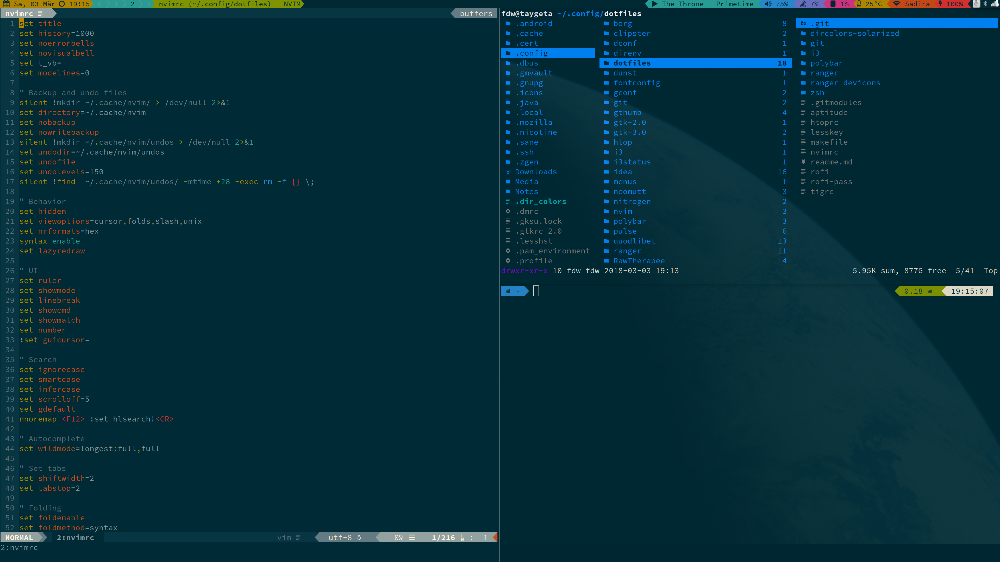

# Dotfiles

## Screenshot & Overview



This repo contains dotfiles for my workspace that is focused on terminal based apps (Nvim, ranger, autojump) and a lightweight window manager (i3, rofi, polybar). Everything is meant to integrate with everything else, starting from the theme: Solarized Dark.

## Detailed Content

### zshrc for [ZSH](http://zsh.org/)
* Plugins organized with [zgen](https://github.com/tarjoilija/zgen)
* [Autojump](https://github.com/joelthelion/autojump)
	* `r` asks Autojump for the best directory and opens Ranger there, thanks to [ranger+autojump](https://github.com/fdw/ranger_autojump)
* Autocompletion configuration with [fzf](https://github.com/junegunn/fzf) thanks to [fzf-tab](https://github.com/Aloxaf/fzf-tab)
  * fzf also with [ripgrep](https://github.com/BurntSushi/ripgrep) for file and history search
* [Fast Syntax highlighting](https://github.com/zdharma/fast-syntax-highlighting)
* [History-substring-search](https://github.com/zsh-users/zsh-history-substring-search)
* [Autosuggestions](https://github.com/zsh-users/zsh-autosuggestions)
* [Powerline10k Theme](https://github.com/romkatv/powerlevel10k)
* Some nice aliases
	* `g` is short for git
	* `v` opens Neovim
* Supports [Direnv](https://github.com/direnv/direnv)

### vimrc/nvimrc for [Neovim](https://neovim.io/)
* Continous undo
* Plugins organized with [Vim-Plug](https://github.com/junegunn/vim-plug)
* [fzf](https://github.com/junegunn/fzf) [for vim](https://github.com/junegunn/fzf.vim)
* [Vim-Sneak](https://github.com/justinmk/vim-sneak)
* [Startify](https://github.com/mhinz/vim-startify)
* [Devicons](https://github.com/ryanoasis/vim-devicons)
* [Airline](https://github.com/bling/vim-airline)
* [Bufferline](https://github.com/bling/vim-bufferline)
* [Indent Guidelines](https://github.com/nathanaelkane/vim-indent-guides)
* [Sleuth.vim](https://github.com/tpope/vim-sleuth)
* [EasyAlign](https://github.com/junegunn/vim-easy-align)
* [targets.vim](https://github.com/wellle/targets.vim)
* [Solarized Dark theme](https://github.com/lifepillar/vim-solarized8)
* Neovim is set as the default editor

### [i3wm](https://i3wm.org/)
* Here, too, a sensible configuration
* Solarized Dark theme
* Nice window and session modes with helpful status bar hints and shortcuts
* Polybar integration
* Rofi integration
* Works with multiple monitors
* Integrates [autotiling](https://github.com/nwg-piotr/autotiling)

### [Polybar](https://github.com/jaagr/polybar/)
* Solarized Dark theme
* Styled after Powerline

### [Rofi](https://davedavenport.github.io/rofi/)
* Solarized
* Uses a combi mode for drun and ssh
* Sidebar offers each of these modi seperately
* [clipster](https://github.com/mrichar1/clipster) & [roficlip](https://github.com/gilbertw1/roficlip)
* [rofi-pass](https://github.com/carnager/rofi-pass)
* [rofimoji](https://github.com/fdw/rofimoji)
* [rofi-calc](https://github.com/svenstaro/rofi-calc)

### [ranger](http://ranger.nongnu.org/)
* Sensible configuration
* Some useful keybindings
* Easy extraction and compression with [atool](http://www.nongnu.org/atool/)
* [Devicons](https://github.com/alexanderjeurissen/ranger_devicons/)
* [Autojump-Support](https://github.com/fdw/ranger_autojump)

### [neomutt](https://neomutt.org/)
* Solarized, of course
* Vim-inspired shortcuts
* Set up to use [khard](https://github.com/scheibler/khard) as an address book

### [kitty](https://github.com/kovidgoyal/kitty)
* Solarized Dark theme
* Separate escape code for ctrl+enter that works with zsh's autosuggestions
* Supports ranger's image previews

### gitconfig
* Sensible configuration
* Useful aliases (contains assume, unstage and shortcuts for the most often used commands)
* needs to be configured with your own name and email
* Always ignores direnv files

### [Zathura](https://github.com/pwmt/zathura)
* Solarized colors

### lesskey
* Same keymappings as vim (optimized for German keyboards)

### tig
* Nothing much

### htop
* styled for my taste

## Installation
```
git clone --recursive https://github.com/fdw/dotfiles.git ~/.config/dotfiles
cd .config/dotfiles
make install
```

## Updating
```
make update
```

# Other helpful Programs
* [ripgrep](https://github.com/BurntSushi/ripgrep)
* [fd](https://github.com/sharkdp/fd)
